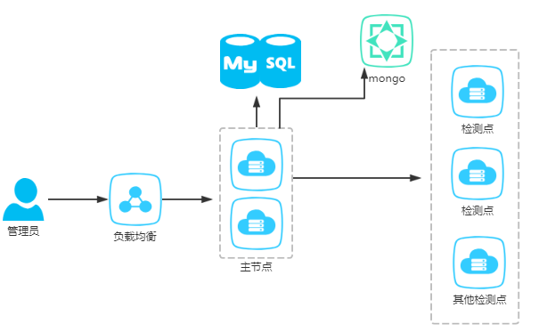
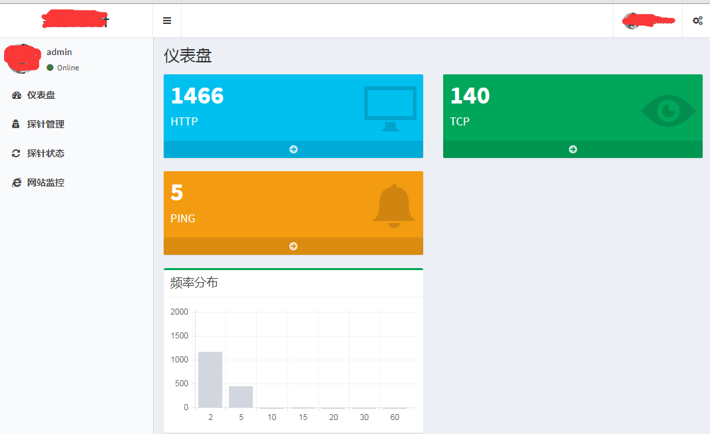
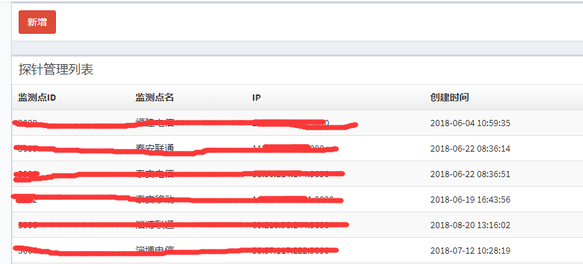
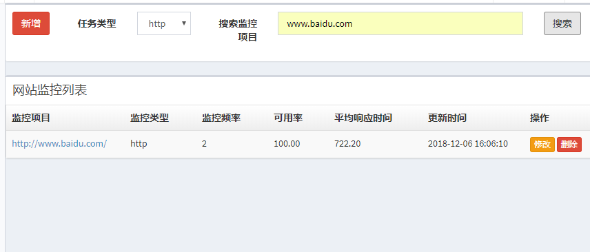
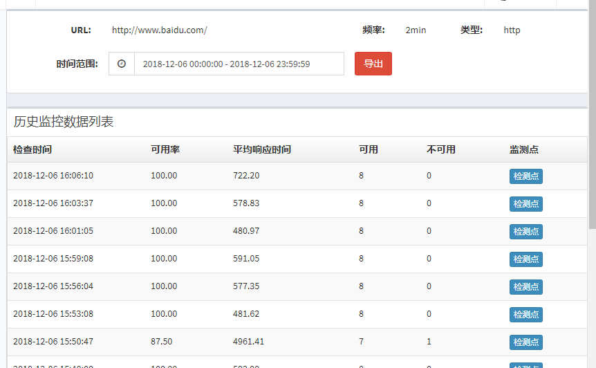
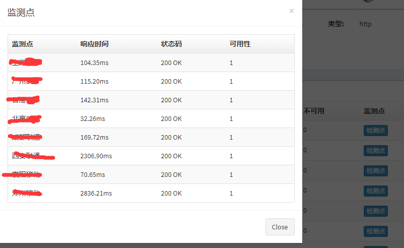

# site-monitor
这是一个监控站点是否可以访问的系统.   简单来说就是在不同地域、不同运营商环境部署一些监测点，然后将各个监测点结果汇总起来，精确的去判断站点的可访问性.

## 架构图

## 功能

支持不同类型任务检测:

- http:  检测站点是否可以访问
- tcp: 检测ip或域名端口
- ping: 检测域名ping

检测方式:

- 使用python requests库检测
- 使用`pyppeteer`,chrome headless方式检测

性能:

- 网速允许的情况下,可支持`1W+`的站点并发检测
- 使用`ThreadPoolExecutor`作为并发检测, 在这个基础上加入了超时检测，避免线程卡主.

## 演示

####  首页

展示了`http`、`tcp`、`ping`这三种任务数量. 以及不同监控频率任务分布.

#### 监测点管理

#### 任务列表

#### 任务结果

#### 任务监测点快照

## 部署

主节点和检测节点里有部署说明.

## 感谢

如果对你有帮助,  挥动你的鼠标采采星星.

有问疑问可以交流. 或者一些主机监控系统、DNS监控、持续集成等都可以交流.
